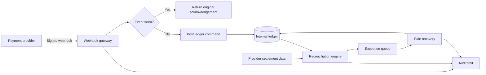

# Africa Payment Reconciliation Lab

**A portfolio-grade fintech operations workspace for detecting, explaining and safely recovering payment differences across asynchronous providers and an internal ledger.**

ReconLab demonstrates the engineering behind reliable payment processing: signed webhooks, schema validation, idempotency, integer money handling, reconciliation rules, exception triage, compensating entries and an attributable audit trail.

> This repository is a technical demonstration. Every provider, customer, transaction and balance shown in the application is synthetic. It does not connect to live financial accounts or move real money.

## Why this project exists

A provider can confirm a payment while an internal write times out. A webhook can arrive twice. A settlement export can disagree with the application database. A reversal can arrive hours after the original credit.

Those are not unusual edge cases. They are normal consequences of distributed systems, intermittent networks and independently operated payment providers.

The real engineering question is not only, “Can the API accept a payment?” It is:

> Can the system prove what happened, find what disagrees and recover without losing or duplicating money?

ReconLab provides an inspectable answer.

## Live product experience

The dashboard lets a reviewer run three controlled scenarios without credentials:

1. **Missing ledger entry** — a provider reports success, but the internal posting is intentionally omitted.
2. **Amount mismatch** — the provider and ledger share a reference but disagree on value.
3. **Duplicate webhook** — the same event is delivered twice and the second write is blocked.

Each scenario passes through the same domain services used by the HTTP routes. It is not a pre-rendered animation. The resulting transaction, reconciliation case, metrics and audit events are created while the reviewer uses the application.

## What the project demonstrates

### Payment integration engineering

- HMAC verification of raw webhook bodies
- provider-specific route boundaries
- runtime schema validation with Zod
- provider event and merchant reference tracking
- deterministic acknowledgement of duplicate deliveries

### Financial correctness

- amounts represented as integers, never floating point
- ISO currency stored beside every monetary value
- explicit payment and ledger state comparison
- append-only provider evidence
- recovery through compensating actions rather than silent history edits

### Reconciliation operations

- matching provider records to ledger entries
- classification by failure type and severity
- expected-versus-observed evidence
- actionable recovery recommendations
- rerunning reconciliation after a correction
- provider health, lag and throughput visibility

### Engineering quality

- domain logic isolated from the UI and HTTP adapters
- responsive and accessible operations interface
- automated tests for the highest-risk rules
- production-oriented PostgreSQL schema
- documented deployment and scaling path

## System architecture



The public demo uses a process-local repository so it remains free to run and easy to review. The reconciliation rules are independent from storage. A PostgreSQL model for a durable deployment is included in [`database/schema.sql`](database/schema.sql).

See [`docs/ARCHITECTURE.md`](docs/ARCHITECTURE.md) for request flows, correctness properties, failure classifications and the recommended production topology.

## Reconciliation logic

Records are first paired through the normalized external provider reference. A matched pair must also agree on currency, integer amount and lifecycle state.

The current rules run in a deliberate order:

1. Confirm that the expected counterpart exists.
2. Compare currency before attempting financial arithmetic.
3. Compare amounts in the currency's minor unit.
4. Map provider state to the expected ledger state.
5. Classify any remaining ledger-only record.

The engine produces a typed exception instead of a generic failure message.

| Exception | Example | Severity in demo | Recovery principle |
| --- | --- | --- | --- |
| Missing ledger entry | Provider says successful; ledger has no row | Critical | Validate provider evidence and replay once |
| Missing provider record | Ledger contains an optimistic posting | High | Verify independently, then compensate |
| Amount mismatch | Provider has 310,000 XAF; ledger has 300,000 XAF | High | Investigate fees/capture before adjustment |
| Currency mismatch | Same reference uses XAF and XOF | Critical | Quarantine and fix configuration |
| Status mismatch | Provider is successful; ledger is pending | High | Fetch latest state and advance safely |
| Duplicate delivery | Identical event ID received again | Prevented | Return previous acknowledgement; no write |

## Idempotency model

Payment providers retry webhook deliveries when acknowledgements are delayed or lost. Therefore, “exactly once delivery” should not be assumed.

ReconLab treats `provider + eventId` as the admission key:

```text
first delivery  -> reserve key -> process event -> save acknowledgement
later delivery  -> find key    -> return acknowledgement -> do not write again
```

The demo exposes this behavior through the **Duplicate webhook** scenario and records every prevented duplicate in the audit trail.

In production, the reservation and resulting state transition should share one database transaction or use an inbox/outbox pattern. The unique constraint in the supplied PostgreSQL schema supplies the final concurrency guard.

## Safe recovery

Financial evidence is not ordinary editable content. Mutating an original record can make the balance look correct while destroying the explanation of how it became incorrect.

ReconLab therefore models recovery as a new action:

- the original provider event remains unchanged;
- the operator receives the evidence and recommended response;
- a compensating ledger action repairs the current state;
- reconciliation runs again to verify the repair;
- an audit event links the actor, case and outcome.

## Technology

| Layer | Choice | Reason |
| --- | --- | --- |
| Web application | Next.js App Router + React | One deployable unit for dashboard and APIs |
| Language | TypeScript | Typed domain states and adapter contracts |
| Validation | Zod | Reject malformed provider payloads at runtime |
| Styling | Tailwind build pipeline + custom CSS system | Responsive UI without a heavyweight component kit |
| Icons | Lucide React | Accessible, consistent interface symbols |
| Tests | Vitest + V8 coverage | Fast unit tests for financial correctness rules |
| Production data model | PostgreSQL | Constraints, transactions, indexing and audit durability |
| Packaging | Multi-stage Docker build | Reproducible Node deployment with a non-root runtime |

## Repository structure

```text
africa-payment-reconciliation-lab/
├── database/
│   └── schema.sql                 # Durable PostgreSQL model and service roles
├── docs/
│   ├── ARCHITECTURE.md            # Failure model and production topology
│   └── DEMO_SCRIPT.md             # 75–100 second LinkedIn walkthrough
├── src/
│   ├── app/
│   │   ├── api/
│   │   │   ├── webhooks/          # Signed provider webhook boundary
│   │   │   ├── reconcile/         # Manual reconciliation trigger
│   │   │   ├── simulate/          # Controlled failure generator
│   │   │   └── cases/             # Recovery action
│   │   ├── globals.css            # Responsive visual system
│   │   └── page.tsx               # Dashboard entry point
│   ├── components/
│   │   └── reconciliation-dashboard.tsx
│   ├── domain/
│   │   ├── reconciliation.ts      # Pure matching and classification engine
│   │   ├── reconciliation.test.ts
│   │   ├── format.ts
│   │   └── types.ts
│   └── lib/
│       ├── security.ts            # HMAC signing and constant-time verification
│       ├── seed.ts                # Synthetic multi-provider dataset
│       ├── store.ts               # Demo repository and application services
│       └── validation.ts          # External payload schemas
├── .env.example
└── vitest.config.ts
```

## API surface

| Method | Route | Purpose |
| --- | --- | --- |
| `GET` | `/api/dashboard` | Current metrics, provider health, cases and audit events |
| `POST` | `/api/webhooks/:provider` | Verify and ingest a signed provider event |
| `POST` | `/api/reconcile` | Compare provider records with the internal ledger |
| `POST` | `/api/simulate` | Generate one controlled demonstration failure |
| `POST` | `/api/cases/:id/resolve` | Apply a safe recovery action and verify it |
| `POST` | `/api/reset` | Restore the baseline synthetic dataset |

### Signed webhook example

Create a file called `payload.json`:

```json
{
  "eventId": "evt_external_0001",
  "provider": "mobimoney",
  "externalReference": "MM-EXT-0001",
  "merchantReference": "ORDER-EXT-0001",
  "amountMinor": 75000,
  "currency": "XAF",
  "status": "successful",
  "customerLabel": "API demonstration",
  "occurredAt": "2026-09-20T08:00:00.000Z"
}
```

Generate the expected development signature:

```bash
node -e "const fs=require('fs'),c=require('crypto'),b=fs.readFileSync('payload.json','utf8');console.log(c.createHmac('sha256','local-demo-secret').update(b).digest('hex'))"
```

Send the exact signed bytes:

```bash
curl -i http://localhost:3000/api/webhooks/mobimoney \
  -H "Content-Type: application/json" \
  -H "x-recon-signature: REPLACE_WITH_GENERATED_SIGNATURE" \
  --data-binary @payload.json
```

Changing even one byte after signing returns `401 Invalid webhook signature`.

## Run locally

Requirements:

- Node.js 20.9 or later
- npm 10 or later

```bash
git clone https://github.com/J-Massoda/africa-payment-reconciliation-lab.git
cd africa-payment-reconciliation-lab
cp .env.example .env.local
npm install
npm run dev
```

Open [http://localhost:3000](http://localhost:3000).

No database, provider account or payment credential is required for demo mode.

## Quality checks

```bash
npm run lint
npm test
npm run test:coverage
npm run build
```

The automated tests cover:

- valid record matching;
- missing ledger classification;
- amount and currency mismatch precedence;
- orphan ledger detection;
- valid HMAC signatures;
- tampered payload and malformed signature rejection.

## Deployment

### Portfolio demo

Deploy the repository to a Node-compatible platform such as Vercel or Render. Add a long random `WEBHOOK_SIGNING_SECRET` in the platform's secret manager.

The demo store is intentionally ephemeral. A cold start or new server instance can return to the seed dataset, and the **Reset lab** action always restores it. That behavior is appropriate for a public interactive demonstration because visitors cannot permanently alter shared data.

The included container can be built and run with:

```bash
docker build -t reconlab .
docker run --rm -p 3000:3000 \
  -e WEBHOOK_SIGNING_SECRET=replace-with-a-long-random-secret \
  reconlab
```

### Production adaptation

Before real financial use:

1. implement the repository interface with PostgreSQL using [`database/schema.sql`](database/schema.sql);
2. place webhook processing behind a durable queue;
3. reserve idempotency keys transactionally;
4. encrypt provider secrets and rotate them;
5. enforce operator authentication, role-based approvals and correction limits;
6. add provider settlement-file ingestion independent from webhooks;
7. emit metrics, logs and traces to an external observability platform;
8. add load, concurrency, contract and failure-injection tests;
9. complete security, privacy and regulatory reviews for the operating markets.

## Security decisions

- HMAC signatures are compared with Node's constant-time `timingSafeEqual`.
- The signature covers the raw request body, not a parsed-and-reserialized object.
- Zod rejects invalid identifiers, currencies, states and amounts.
- Provider evidence is treated as immutable input.
- Duplicate admission is blocked before a ledger write.
- The SQL design separates reader, reconciliation-worker and recovery-writer roles.
- No real customer data, provider keys or financial credentials are included.

## Deliberate tradeoffs

### In-memory public demo

**Benefit:** zero-configuration evaluation and safe reset between demonstrations.  
**Cost:** not durable across processes or deploys.  
**Production answer:** PostgreSQL repository plus a durable queue.

### Deterministic matching

**Benefit:** every automated match is explainable.  
**Cost:** some providers require secondary matching when references are inconsistent.  
**Production answer:** surface ranked candidates to an operator, but do not auto-post an uncertain correction.

### Synchronous demo recovery

**Benefit:** a reviewer can see the complete lifecycle immediately.  
**Cost:** real providers and ledgers may be temporarily unavailable.  
**Production answer:** command queue, bounded exponential backoff, dead-letter review and circuit breakers.

## Roadmap

- [ ] PostgreSQL repository adapter and migrations
- [ ] Redis-backed idempotency reservation
- [ ] CSV/SFTP settlement-file import
- [ ] approval thresholds for high-value recovery
- [ ] multicurrency fee and FX reconciliation
- [ ] OpenTelemetry traces and service-level objectives
- [ ] provider contract-test harness
- [ ] multi-tenant merchant workspaces
- [ ] downloadable reconciliation reports
- [ ] offline-capable exception review queue

## Video walkthrough

[`docs/DEMO_SCRIPT.md`](docs/DEMO_SCRIPT.md) contains a complete 75–100 second LinkedIn recording plan. It demonstrates the missing-ledger failure, the evidence view, safe recovery, duplicate delivery protection and the audit trail.

## Author

**Jean Emilien Massoda**  
Full-stack and backend engineer focused on fintech APIs, payment reliability, WordPress/WooCommerce integrations and resilient digital products.

- Portfolio: [massoda.me](https://massoda.me)
- GitHub: [J-Massoda](https://github.com/J-Massoda)
- Email: [hello@massoda.me](mailto:hello@massoda.me)

## License

This demonstration is released under the MIT License. Provider names used inside the interface are fictional sandbox labels. No affiliation with a real payment provider is implied.
