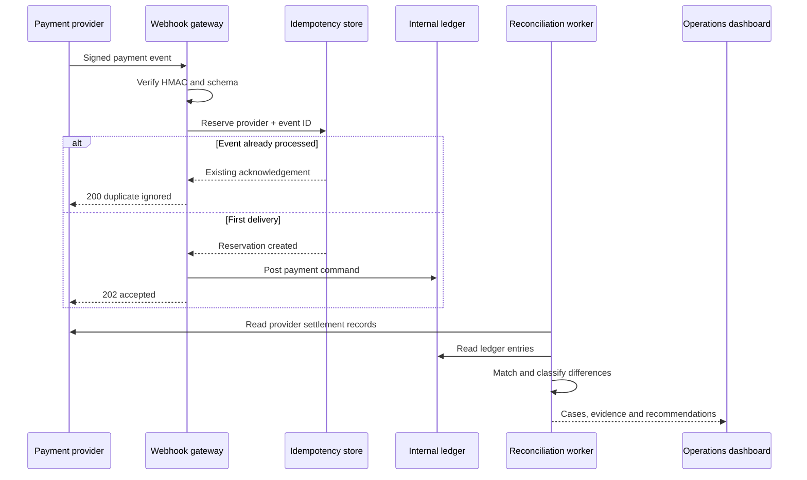
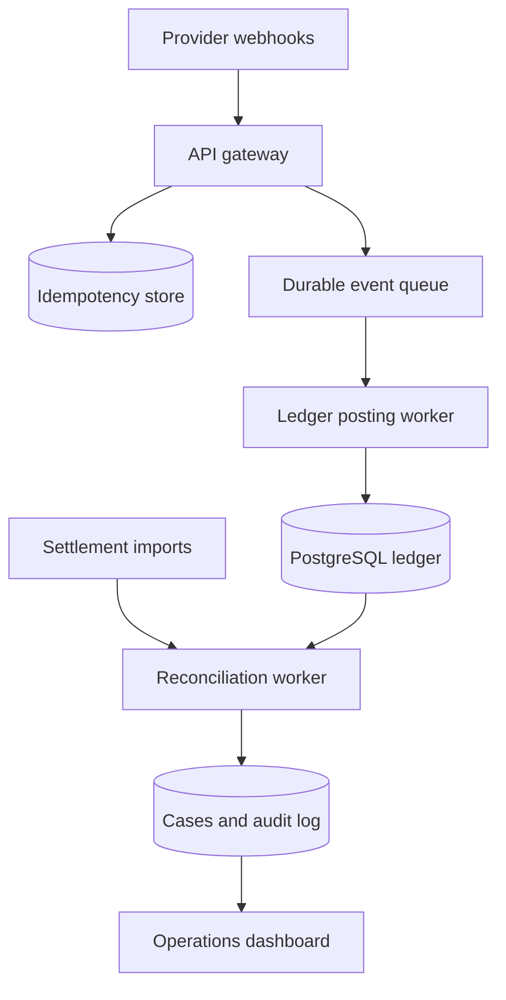

# Architecture notes

## Design objective

ReconLab is designed around one constraint: an unreliable asynchronous message must never create an untraceable or duplicate balance change.

The public demo keeps state in memory so anyone can run it without a payment-provider account or database. The domain layer is separated from the adapter, which allows the same reconciliation engine to be connected to PostgreSQL and a durable queue without rewriting the matching rules.

## Request flow

## Reconciliation key

The demo uses a provider external reference as the primary deterministic match key. A production integration should maintain a provider-specific normalization layer and may need a composite match strategy:

1. provider identifier + external reference;
2. merchant reference;
3. amount in minor units + ISO currency;
4. time-window tolerance;
5. payment state transition.

Approximate matching can help an operator discover candidates, but it must not silently post a financial correction.

## Failure classifications

| Classification | Meaning | Default response |
| --- | --- | --- |
| `missing_ledger_entry` | Provider evidence exists but no internal posting exists | Verify provider receipt, then replay with the original idempotency key |
| `missing_provider_record` | Ledger posting has no provider evidence | Investigate optimistic posting, then reverse with a compensating entry |
| `amount_mismatch` | Provider and ledger values differ | Check fees, partial captures and conversion before adjustment |
| `currency_mismatch` | Same reference uses different currencies | Quarantine and verify merchant configuration |
| `status_mismatch` | The provider and ledger disagree on lifecycle state | Fetch latest state and apply a valid forward transition |
| `duplicate_event` | A known provider event was delivered again | Return the original acknowledgement and do not write again |

## Correctness properties

### Idempotent webhook admission

The pair `(provider, event_id)` is unique. A replay returns the previous result and increments an operational counter; it does not create a second transaction or ledger entry.

### Integer money representation

Amounts are stored as integers in the currency's minor unit. Zero-decimal currencies such as XAF and XOF are never passed through floating-point arithmetic.

### Append-only provider evidence

Provider events are evidence. Recovery does not edit the original payload. Corrections are modeled as new ledger entries linked to the entry they compensate.

### Traceable operations

Every reconciliation run and recovery action records its actor, target, outcome and time. The production schema includes a previous-event hash field for a tamper-evident audit chain.

## Production topology

Recommended production additions:

- PostgreSQL transactions and row-level locking for durable state;
- Redis or a database-backed idempotency store with an intentional retention policy;
- a durable queue with exponential backoff and a dead-letter queue;
- provider-specific circuit breakers, rate limits and timeout budgets;
- OpenTelemetry traces connected by event ID, external reference and run ID;
- encrypted secret storage and automatic key rotation;
- role-based approval for high-value corrections;
- daily provider settlement-file ingestion as an independent source of truth.
